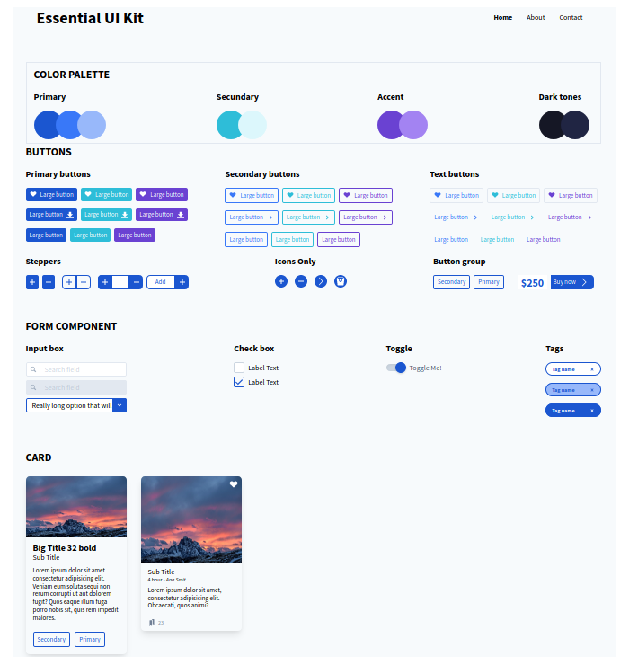

# ESSENTIAL-UI-KIT
Un UI Kit sencillo Victor UX/UI @victoruxui

## Descripcion
El amigo Victor UX/UI @victoruxui, creo un sencillo user interface para nuestros proyectos, lo estoy replicando en html con ayuda de @tailwindcss para lo que es la parte del css.

## Repositorio UI Kit
```bash
  [adobe.com/UIKit](https://xd.adobe.com/view/0aaa347e-df47-424d-5329-72fa833ae47d-7c9b)  
```

## Twitter
```bash
  Victor UX/UI @victoruxui
  Pedro @obando71
```

## Vista previa
```bash
  
```

## Estatus Actual
```bash
  Terminado
```

License

Pedro Obando is MIT licensed.
